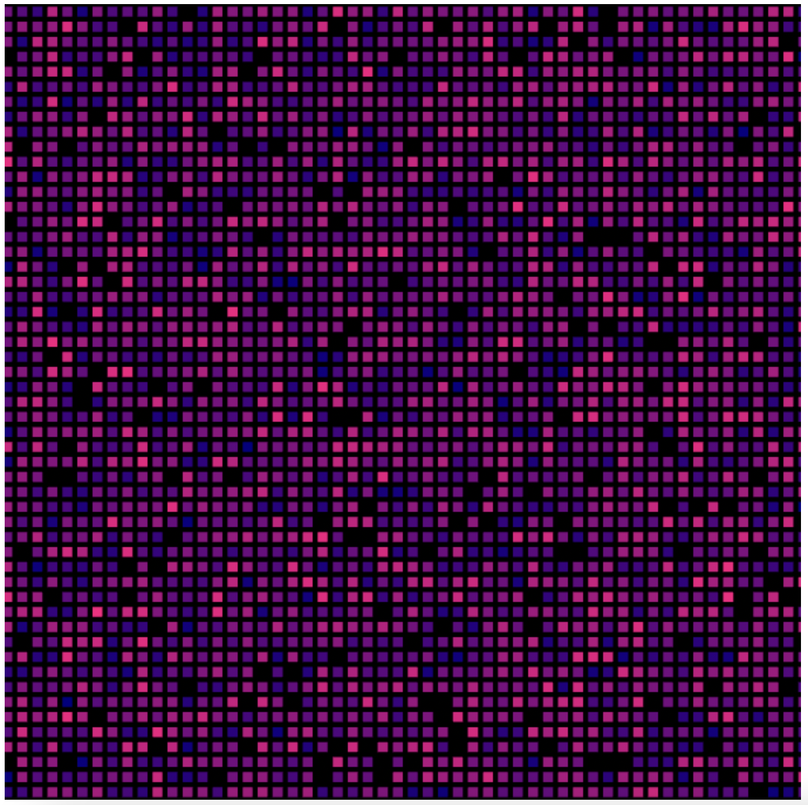
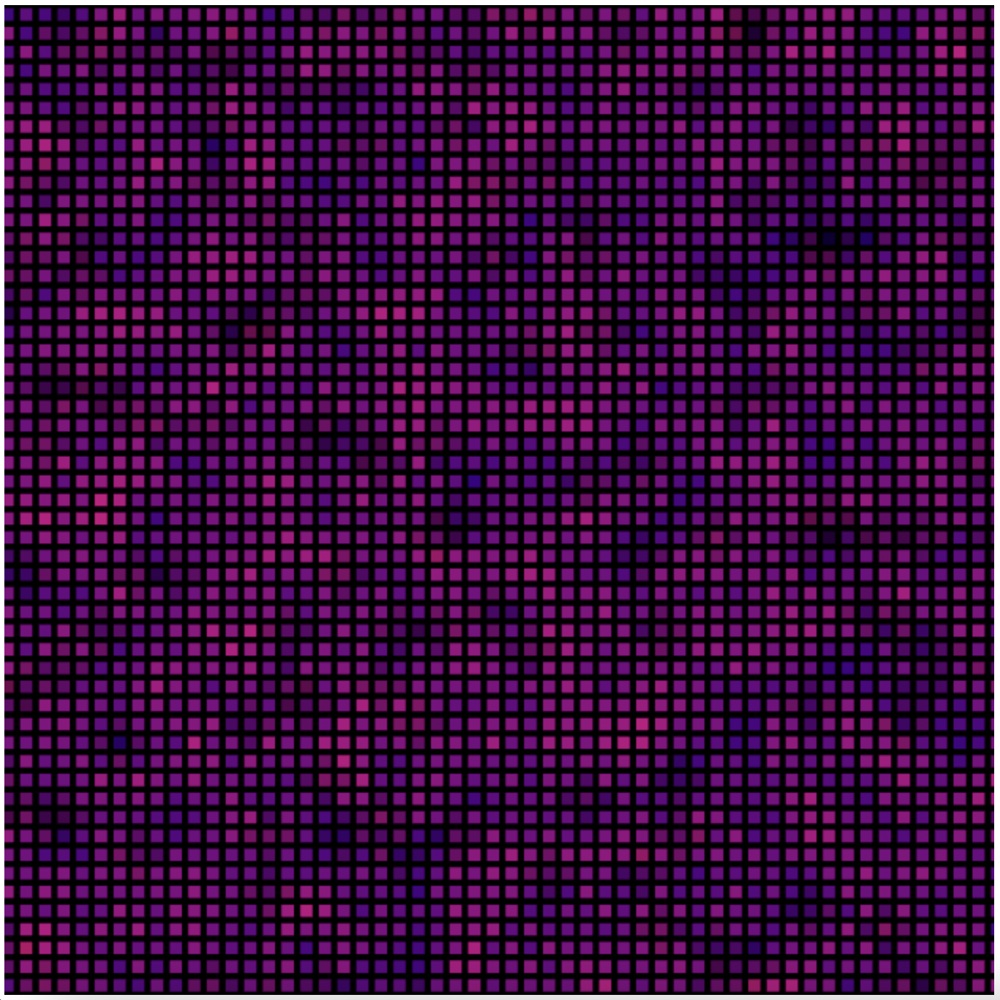

# Sensor Fusion Visualizer

This is a simulation for demonstrating the concept of sensor fusion.

Using WebGL, it draws 2D colored grid representing readings from a network of distributed temperature sensors.

Full details are in the writeup on the web page.

This is a set of sensor "samples" for a given temperature

This is a different set of sensor "samples" for the same temperature, after sensor fusion has been applied. Notice that "hotspots" are more muted.

